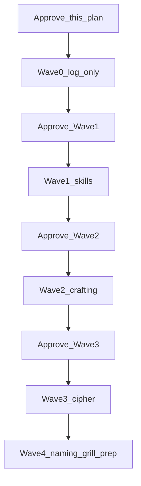

# Plan — Feedback Capture + Sequenced Research (2026-07-19)

> **Status:** Waves 0–3 COMPLETE 2026-07-19. Wave 4 (naming / grill prep) not started.
> **Constraint:** All future research must be in-depth (designer + systems + pitfalls + creative), GDD-aware (no orphan proposals), and must search existing docs before inventing “new” mechanics. Token-efficient prose; do not thin the analysis.

### Model assignment (2026-07-19)
| Wave | Model | Notes |
|------|--------|--------|
| 0 Capture | `cursor-grok-4.5-medium` | Done — [Wave 0](cb9b679c-2f1f-4b57-ad94-d6fb605a38e7) |
| 1 Skills | `cursor-grok-4.5-medium` | Done — [Wave 1](eb343913-6087-410a-887f-77b7be6b385e) (Opus retry after API limit) |
| 2 Crafting | `cursor-grok-4.5-medium` | Done — [Wave 2](9c4d15da-4bfc-4315-a427-cf0ec510888e) |
| 3 Cipher progression | `cursor-grok-4.5-medium` | Done — [Wave 3](c7f3d1fd-24c3-448c-95ab-b76de6208923) |

### Amendments (2026-07-19 evening)
- **Phrecia Idol System** (correct spelling; was miswritten Frisia).
- **Runeseeker Call Unique (Tuning Fork)** — instrument can come in different shapes for named NPC static designs.
- **Affinity / Frequency / Alpha–Delta:** Owner asserts this was *not* final. Alpha/Beta/Gamma/Delta naming was to be removed (poor names + a replacement idea inside the Skill Frame system). Wave 0 must audit all GDDs + transcripts; if removal isn’t logged, create an explicit IDEA_LOG + SESSION_FEEDBACK gap entry. Soft-fail match-as-bonus intent may survive under a different name/mechanic — do not treat DOC_v3 Frequency tags as locked final vocabulary.

---

## Failure mode this plan prevents

The AllFlame analysis treated colour-as-reward as a PoE2 lesson. **DOC_v3 still documents soft-fail match-as-bonus** (Frequency Empowerment / Soft-Fail Colour System) — but **owner says Alpha/Beta/Gamma/Delta Affinity naming was superseded in session and may not have been written down**. Agents must cite current GDD text *and* the owner gap entry; do not treat Frequency vocabulary as locked.

```883:883:DOC_v3.md
| **Frequency**       | Alpha, Beta, Gamma, Delta                | Skill Frame socket colour matching                         |
```

```998:998:DOC_v3.md
Matching a support card's attribute colour to its satellite node grants a **Resonance bonus** — not a gate. Mismatched sockets still work at reduced effectiveness. ...
```

Every Wave 1+ agent must run a mandatory **GDD cross-check pass** (grep CONTEXT + DOC_v2–v6 + SESSION_DECISIONS + IDEA_LOG + prior research + agent transcripts if needed) and cite hits before proposing analogues.

---

## Sold vs reopened vs dropped (this dump)

### Sold / keep
- Crafting framework name **Agent** (and existing ReAgent / DeAgent / enAgent taxonomy in DOC_v5 §§42–44 — audit for MVP overload later)
- Uncapped functional barter philosophy (currency research §1)
- Sticky global Cipher charges **and** per-run juice both allowed
- Multi-region Cipher Network; hub + frontier/edge fiction
- Ascendancy **central hub node** (cluster-jewel geometry) — expand into GDD draft
- Affinity/colour as **bonus not hard lock** (already in DOC_v3)
- Build-your-own-game-mode / factory specialization vector for Cipher board
- Community-driven research longevity via clear rules + mysterious weights

### Reopened / soft
- Forge Terminal / Imprint / full Agent operation list / gold-as-currency
- “Forge Agents” naming (Terminal word dubious)
- External Skill Frame → **creature-as-container** (constellation may remain as shape)
- Gl!tch fiction (not Vaal corruption clone; operations may still rhyme)
- Examiner → Herald / Architect / Engineer (do not lock)
- Network Agents rename (collision with crafting Agents)
- Threat Attunement → creature intensity / severity / threat (+ non-pack-size fourth dial)
- Guide title: Quartermaster / Head Engineer / fantasy-leadership title
- Cipher fuel vs progression-wealth tension (design tension; do **not** ban Kirac-style buyouts unexamined — they create diversifying avenues)

### Drop / cancel
- **Splice Agent** (cancelled — Unique fragment on Rare is too strong; fracture/lock downstream catastrophic)
- Blind copy of PoE2 socket system as primary skill inspiration
- Skills on gear sockets (gear sockets → **modules** / rollable inner systems instead)
- Laborious potion-crafting / heavy RPG busywork unless it earns its keep

---

## Wave 0 — Capture only (parent agent, no research subagents)

After you approve Wave 0:

1. Append **IDEA_LOG.md** for every bullet in the 2026-07-19 dump (see checklist below).
2. Patch **IDEA-005**: cancel Splice with rationale.
3. Expand Ascendancy central hub into progression GDD (DOC_v3 / Motherboard Grid / Pinnacle Evolution section) as **draft**, link `POE_CLASS_PASSIVE_TREE_RESEARCH.md`.
4. Add IDEA_LOG correction: DOC_v3 Frequency / colour-match Resonance bonus already existed.
5. Write **SESSION_FEEDBACK_2026-07-19.md** mapping dump → IDEA IDs → research waves.

### IDEA_LOG checklist (must not miss)

- Emissary of \<administrative being\> class rename (Luminary-related)
- Splice cancel
- Sticky Cipher global mods OK
- Forge Agents naming; Terminal soft
- Agent-only foundation rethink; ReAgent/DeAgent MVP audit
- Skills on creature; drop external Skill Frame container; keep constellation shape candidate
- Gear sockets = modules (not skills); soldering keyword
- Active / support / optional third avenue
- PoE1 vs PoE2 links preference
- Resonance/STAB as discoverable type/team levers under skill rethink
- Wand = **Runeseeker Call Unique (Tuning Fork)** instrument + mid-layer dial; shapes may vary for named NPC static designs
- Affinity/Frequency Alpha–Delta: intended removal + replacement idea — audit GDDs; log gap if missing
- Gearing 5×10 ≈ 50 crafts problem; empty slots OK early; role-distributed defenses
- Party loot = squad rules; multiplayer loot separate; no free self-host that kills monetization
- Cipher program naming; first Cipher loop (init/layout/creatures/completion/rewards → board)
- Profiles as alternate Cipher boards / fresh game-mode starts
- **Phrecia Idol System** high-commitment depth (guardrails later)
- Creature intensity / severity / threat (+ alt for pack size)
- Hub / frontier edge / governance light-touch
- Guide occupation titles
- Examiner → Herald/Architect reopen
- Network Agents rename + L1–L4 salt-frontier beat sheet
- Assembly / compile / transpile originals
- BIOS/Voidstone-style Grid patches
- Cipher Touch / ghosted modifiers
- 3.29 Chaos bench rerolls as operation inspiration
- Nebby-like legendary creature narrative (redesign, not copy)
- Creature naming session needed
- Pinnacle quote craft
- AllFlame refined: vessel hub later; Vesper-like entity; chart voyage as league candidate; ghost-roll ops carefully; anomalies more player-agentic; hire = Technician+creatures not merc; affinity bonus already ours; juice loved; learn PoE2 Ritual carefully, not sockets

---

## Wave 1 — Skills research (separate approval)

| Deliverable | Purpose |
|-------------|---------|
| `POE_SKILL_SYSTEM_RESEARCH.md` | History/intent of PoE gems/sockets/links (PoE1 vs PoE2), why unique |
| `SKILLS_REDESIGN_EXPLORATION.md` | Mythoras options: creature-as-frame; active/support/third; modules on gear; instrument wand; Resonance/STAB; GDD cross-check |

Mandatory reads: CONTEXT ownership #2/#9, DOC_v2 Skill Cards, DOC_v3 Frequency/colour Resonance bonus, POE_RESEARCH gem sections, IDEA-024, CURSE_OF_THE_ALLFLAME_ANALYSIS (as contrast only).

**Why first:** Crafting operations and Cipher rewards depend on whether skills live on creatures vs external frames.

---

## Wave 2 — Crafting / Agent foundation (separate approval)

| Deliverable | Purpose |
|-------------|---------|
| `CRAFTING_FOUNDATION_RETHINK.md` | Agent framework kept; Forge/Imprint reopen; operations from creature fantasy; Gl!tch fiction; gear load; gold; party loot |
| `POE_CRAFTING_STEPS_RESEARCH.md` (optional follow-on) | Community emergent crafting steps, weights, lock/block — how to enable player-authored paths without guided rails |

Cite DOC_v5 Agent/ReAgent/DeAgent; cancel Splice; keep Exploit early; temper Compile.

---

## Wave 3 — Cipher Network progression spine (separate approval)

| Deliverable | Purpose |
|-------------|---------|
| `CIPHER_NETWORK_PROGRESSION_DESIGN.md` | Program name; first Cipher anatomy; map + board layers; factory/game-mode authorship; Phrecia Idol-style depth; fuel tension; Cipher Touch; guide arcs; hub/frontier |

Inputs: VISUAL_AND_CIPHER_BOARD_NOTES, POE2_TEMPLE_RESEARCH, POE_ENDGAME_RESEARCH, IDEA-008/013/017/019/029.

---

## Wave 4 — Naming + Grid patches (grill prep)

- Creature naming session agenda
- Emissary class naming
- Herald/Architect candidates
- Network guide occupation titles + Agent-currency collision rename
- Motherboard Grid BIOS/patch / Voidstone-like variation
- Soldering vocabulary

---

## Sequencing



---

## Research quality bar (all waves)

Every research agent prompt must require:
1. GDD/prior-research cross-check section with citations
2. Designer angle + systems angle + pitfalls + creative options
3. Keep / reconsider / not-copy tables tied to Mythoras canon
4. No orphan mechanics that ignore squad/Turn Program/Grid ownership
5. Explicit note when proposing something already named in GDD

---

## Non-goals until later

- Implementing or locking Examiner / Network Agent / Forge names
- Deploying subagents before Wave approvals
- Full numeric Phrecia idol recreation
- Treating AllFlame ghost-roll or chart-voyage as day-one core

---

## Decision gate — CLOSED 2026-07-19

Owner approved parallel Waves 0–3 with model assignment above.
